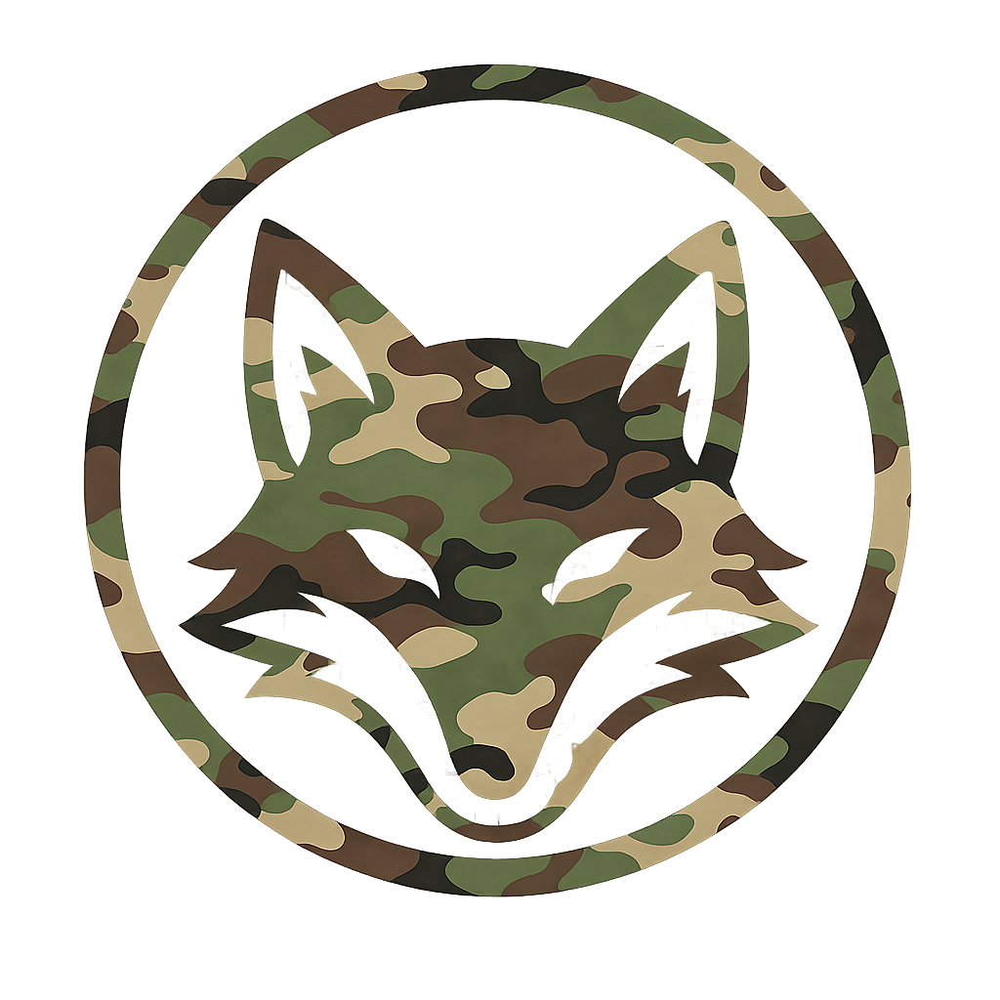

<p align="center">
  
</p>

<h1 align="center">camofox-browser-mcp</h1>

<p align="center">
  MCP server for controlling a local camofox-browser instance.
</p>

<p align="center">
  
  
  
  
  <a href="https://github.com/Microck/opencode-studio"></a>
</p>

---

### quick installation

paste this into your llm agent session:

```text
Install and configure camofox-browser-mcp by following the instructions here:
https://raw.githubusercontent.com/Microck/camofox-browser-mcp/refs/heads/main/INSTALL.md
```

**npm (recommended)**

```bash
npm install -g camofox-browser-mcp
```

MCP server for controlling a local
[jo-inc/camofox-browser](https://github.com/jo-inc/camofox-browser) instance.

This server exposes the full practical camofox-browser workflow to LLM agents:
tab lifecycle, navigation, interaction, snapshots, screenshots, links, stats,
cookie import, session cleanup, YouTube transcript extraction, and high-level
composite helpers (`navigate_and_snapshot`, `scroll_and_snapshot`, `fill_form`,
`type_and_submit`, `batch_click`, `web_search`).

## Prerequisites

1. Node.js 22+ (required for the npm package)
2. Optional: Bun (recommended for local development): <https://bun.sh/docs/installation>
3. A running `camofox-browser` server (default `http://127.0.0.1:9377`)
4. Optional, depending on tools used:
   - `CAMOFOX_API_KEY` for cookie import
   - `CAMOFOX_ADMIN_KEY` for browser stop endpoint

## Installation

### Local development checkout

```bash
git clone https://github.com/Microck/camofox-browser-mcp.git
cd camofox-browser-mcp
bun install
bun run typecheck
bun run build
```

### npm package

```bash
npm install -g camofox-browser-mcp

# optional smoke-run (most users just configure their MCP client)
camofox-browser-mcp
```

## Configuration

Set these environment variables in your MCP client config.

| Variable | Required | Default | Purpose |
| --- | --- | --- | --- |
| `CAMOFOX_BASE_URL` | yes | `http://127.0.0.1:9377` | Base URL of running camofox-browser server |
| `CAMOFOX_URL` | alias | unset | Compatibility alias for `CAMOFOX_BASE_URL` |
| `CAMOFOX_TIMEOUT_MS` | no | `30000` | HTTP timeout for camofox calls |
| `CAMOFOX_TIMEOUT` | alias | unset | Compatibility alias for `CAMOFOX_TIMEOUT_MS` |
| `CAMOFOX_DEFAULT_USER_ID` | no | `default-user` | Default `userId` when omitted |
| `CAMOFOX_DEFAULT_SESSION_KEY` | no | `default-session` | Default `sessionKey` when omitted |
| `CAMOFOX_API_KEY` | for `camofox_import_cookies` | unset | Bearer key for `/sessions/:userId/cookies` |
| `CAMOFOX_ADMIN_KEY` | for `camofox_stop_browser` | unset | Admin key sent as `x-admin-key` for `/stop` |

### Example MCP config (local build)

```json
{
  "mcpServers": {
    "camofox-browser-mcp": {
      "command": "bun",
      "args": ["/absolute/path/to/camofox-browser-mcp/dist/index.js"],
      "env": {
        "MCP_TRANSPORT_TYPE": "stdio",
        "MCP_LOG_LEVEL": "info",
        "CAMOFOX_BASE_URL": "http://127.0.0.1:9377",
        "CAMOFOX_DEFAULT_USER_ID": "default-user",
        "CAMOFOX_DEFAULT_SESSION_KEY": "default-session",
        "CAMOFOX_API_KEY": "",
        "CAMOFOX_ADMIN_KEY": ""
      }
    }
  }
}
```

## Tool coverage

The MCP toolset maps to `camofox-browser` endpoints and includes compatibility
aliases for common `camofox-mcp` prompts.

### Server and session tools

| MCP tool | Endpoint | Notes |
| --- | --- | --- |
| `camofox_health` | `GET /health` | Runtime and browser status |
| `server_status` | alias of `camofox_health` | Compatibility alias |
| `camofox_start_browser` | `POST /start` | Starts browser engine |
| `camofox_stop_browser` | `POST /stop` | Requires admin key |
| `camofox_close_session` | `DELETE /sessions/:userId` | Closes all tabs/context for user |
| `camofox_import_cookies` | `POST /sessions/:userId/cookies` | Requires API key |

### Tab lifecycle tools

| MCP tool | Endpoint | Notes |
| --- | --- | --- |
| `camofox_list_tabs` | `GET /tabs` | Lists open tabs by user |
| `list_tabs` | alias of `camofox_list_tabs` | Compatibility alias |
| `camofox_create_tab` | `POST /tabs` | Creates tab with optional URL |
| `create_tab` | alias of `camofox_create_tab` | Compatibility alias |
| `camofox_close_tab` | `DELETE /tabs/:tabId` | Closes one tab |
| `close_tab` | alias of `camofox_close_tab` | Compatibility alias |
| `camofox_close_tab_group` | `DELETE /tabs/group/:listItemId` | Closes all tabs in group |
| `camofox_get_stats` | `GET /tabs/:tabId/stats` | Usage stats and visited URLs |

### Navigation and interaction tools

| MCP tool | Endpoint | Notes |
| --- | --- | --- |
| `camofox_navigate_tab` | `POST /tabs/:tabId/navigate` | URL or macro navigation |
| `navigate` | alias of `camofox_navigate_tab` | Compatibility alias |
| `navigate_and_snapshot` | composite | Navigate, wait, then snapshot |
| `camofox_wait` | `POST /tabs/:tabId/wait` | Wait for page readiness |
| `camofox_wait_for_text` | `POST /act` (`kind=wait`) | Wait for text appearance |
| `camofox_get_snapshot` | `GET /tabs/:tabId/snapshot` | Ref-based accessibility snapshot |
| `snapshot` | alias of `camofox_get_snapshot` | Compatibility alias |
| `scroll_and_snapshot` | composite | Scroll, then snapshot |
| `camofox_click` | `POST /tabs/:tabId/click` | Click by ref or selector |
| `batch_click` | composite | Execute multiple clicks sequentially |
| `camofox_type` | `POST /tabs/:tabId/type` | Type text by ref/selector |
| `type_text` | alias of `camofox_type` | Compatibility alias |
| `type_and_submit` | composite | Type then press submit key |
| `fill_form` | composite | Fill multiple fields + optional submit click |
| `camofox_hover` | `POST /act` (`kind=hover`) | Hover by ref or selector |
| `camofox_press` | `POST /tabs/:tabId/press` | Keyboard press |
| `camofox_scroll` | `POST /tabs/:tabId/scroll` | Vertical scroll |
| `camofox_scroll_element` | `POST /act` (`kind=scrollIntoView`) | Scroll referenced element into view |
| `camofox_back` | `POST /tabs/:tabId/back` | History back |
| `go_back` | alias of `camofox_back` | Compatibility alias |
| `camofox_forward` | `POST /tabs/:tabId/forward` | History forward |
| `go_forward` | alias of `camofox_forward` | Compatibility alias |
| `camofox_refresh` | `POST /tabs/:tabId/refresh` | Page reload |
| `refresh` | alias of `camofox_refresh` | Compatibility alias |
| `camofox_get_links` | `GET /tabs/:tabId/links` | Extract page links |
| `camofox_screenshot` | `GET /tabs/:tabId/screenshot` | Returns base64 PNG |
| `web_search` | macro wrapper around `navigate` | Multi-engine search helper |

### Content extraction tools

| MCP tool | Endpoint | Notes |
| --- | --- | --- |
| `camofox_youtube_transcript` | `POST /youtube/transcript` | Extracts YouTube captions |

### Supported web_search engines

`web_search` maps `engine` values to backend macros:

- `google`, `youtube`, `amazon`, `reddit`, `wikipedia`, `twitter`, `yelp`
- `spotify`, `netflix`, `linkedin`, `instagram`, `tiktok`, `twitch`

### Compatibility notes

- `list_profiles`, `save_profile`, `load_profile`, and `delete_profile` are not
  exposed yet because current `jo-inc/camofox-browser` APIs do not provide
  cookie export/profile endpoints.

## Typical workflow

1. `camofox_start_browser`
2. `camofox_create_tab` (or `camofox_list_tabs` + reuse)
3. `camofox_navigate_tab`
4. `camofox_get_snapshot`
5. Interact with refs: `camofox_click`, `camofox_type`, `camofox_press`, `camofox_scroll`
6. Re-run `camofox_get_snapshot` after major page changes
7. Cleanup with `camofox_close_tab` or `camofox_close_session`

## Macro support

`camofox_navigate_tab` passes `macro` and `query` through to camofox-browser.
Upstream macros include:

- `@google_search`
- `@youtube_search`
- `@amazon_search`
- `@reddit_search`
- `@reddit_subreddit`
- `@wikipedia_search`
- `@twitter_search`
- `@yelp_search`
- `@spotify_search`
- `@netflix_search`
- `@linkedin_search`
- `@instagram_search`
- `@tiktok_search`
- `@twitch_search`

## Troubleshooting

- `camofox_health` fails: check `CAMOFOX_BASE_URL` and confirm backend is running.
- `camofox_import_cookies` 403: set `CAMOFOX_API_KEY` in both backend and MCP env.
- `camofox_stop_browser` 403: set `CAMOFOX_ADMIN_KEY` in both backend and MCP env.
- Missing refs after navigation: call `camofox_get_snapshot` again.

## License

MIT
